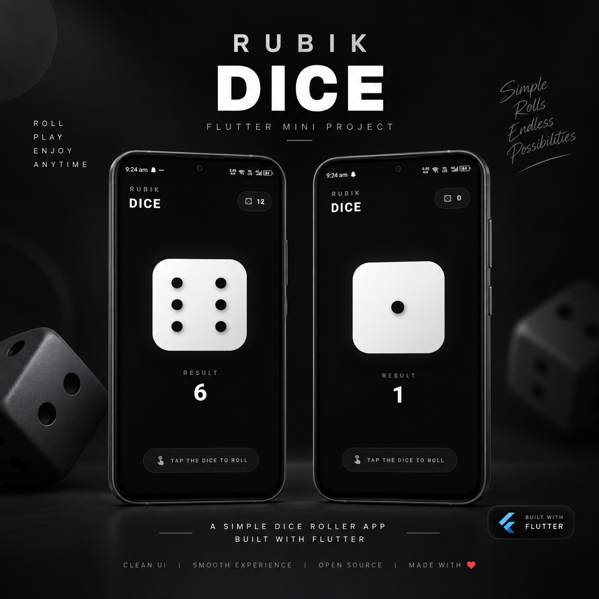

# 🎲 Rubik Dice 

A clean and minimal dice roller mobile application built with
**Flutter** and **Dart**.

Rubik Dice focuses on a simple idea --- tap the dice, roll it, and get a
random result through a smooth and modern interface.

## Preview

<p align="center">
  
</p>

## ✨ Features

-   🎲 Random dice rolling
-   🧩 Clean and minimal user interface
-   ⚡ Fast and responsive interaction
-   📊 Displays the latest dice result
-   📱 Android APK release available
-   🧪 Tested on multiple devices/users with positive feedback

## 🛠️ Tech Stack

-   **Flutter**
-   **Dart**
-   **Android**

## 📂 Project Structure

The repository keeps the structure focused on the application code
rather than listing Flutter's generated platform/build files.

``` text
rubikdice/
├── lib/
│   └── main.dart
├── assets/
├── test/
├── pubspec.yaml
└── README.md
```

> The exact project structure may vary as the application evolves.

## 🚀 Getting Started

### Prerequisites

Make sure you have:

-   Flutter SDK installed
-   Dart SDK
-   Android Studio or VS Code
-   An Android emulator or physical Android device

### Installation

Clone the repository:

``` bash
git clone https://github.com/Yuvrajsinghz/Rubik-Dice.git
```

Move into the project directory:

``` bash
cd rubikdice
```

Install dependencies:

``` bash
flutter pub get
```

Run the application:

``` bash
flutter run
```

## 📦 APK

The Android APK is available through the project's **GitHub Releases**.

**Download:** [Rubik Dice](https://github.com/Yuvrajsinghz/Rubik-Dice/releases/download/v1.0.0/Rubik.Dice.apk)

## 🧪 Testing

The application was tested by sharing the APK with multiple users and
collecting feedback.

The received feedback was positive, helping validate the app's usability
and overall experience.

## 🎯 Learning & Development

This project helped strengthen my practical understanding of:

-   Flutter application development
-   Dart programming
-   Building interactive UI components
-   Handling application state
-   Randomized values and user interactions
-   Creating and testing Android APK builds
-   Preparing a project for GitHub release

## 🤝 Contributing

Contributions, suggestions, and feedback are welcome.

If you find an issue or have an idea for improvement, feel free to open
an issue or submit a pull request.

## 📄 License

This project is available under the **MIT License**.

## 👨‍💻 Author

**Yuvraj Singh Rathore**

-   [GitHub](https://github.com/Yuvrajsinghz)
-   [LinkedIn](https://www.linkedin.com/in/yuvrajsinghz)
-   [LeetCode](https://leetcode.com/u/Yuvrajsinghz/)

------------------------------------------------------------------------

⭐ If you like this project, consider giving the repository a star!
